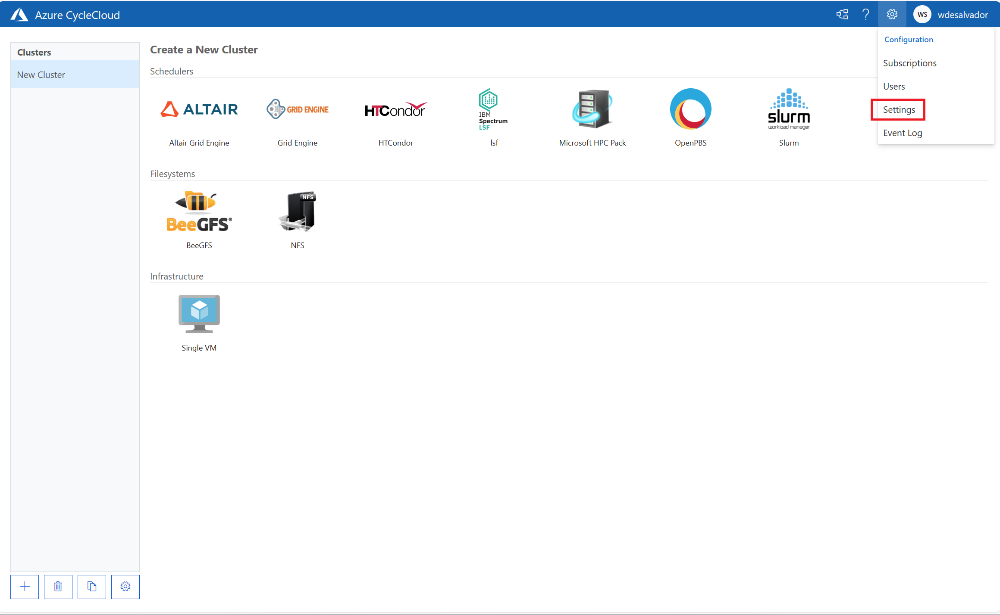
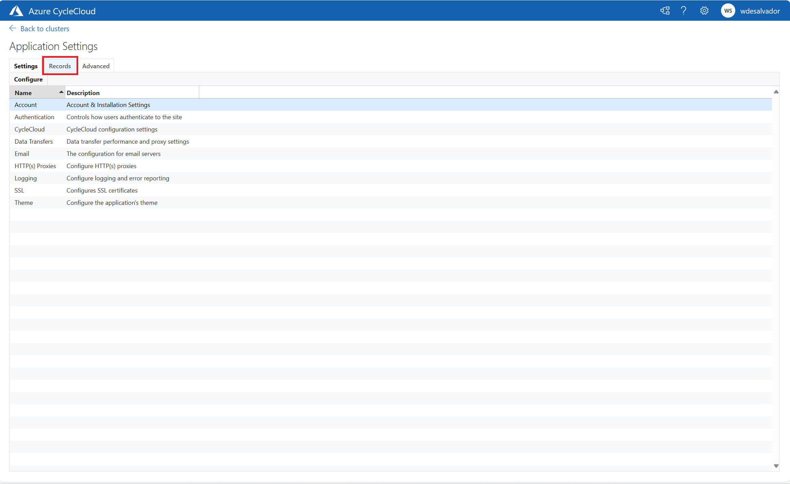
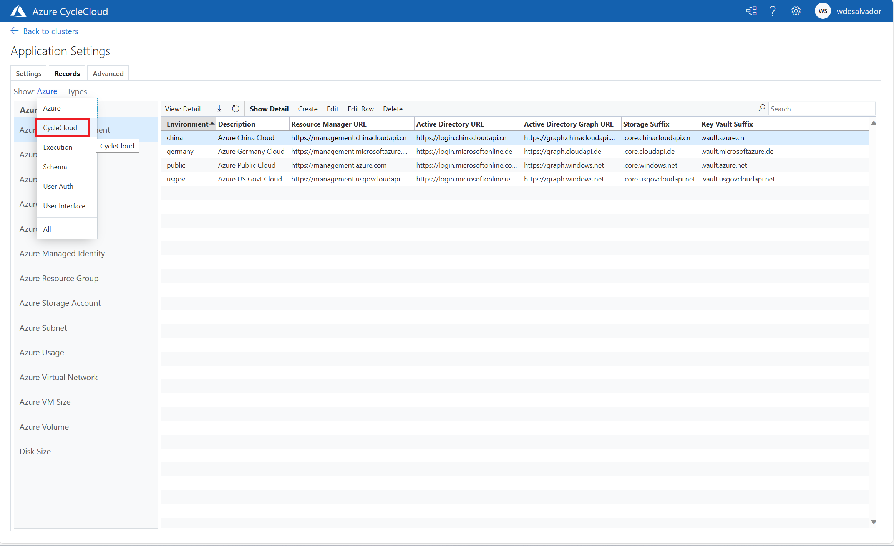
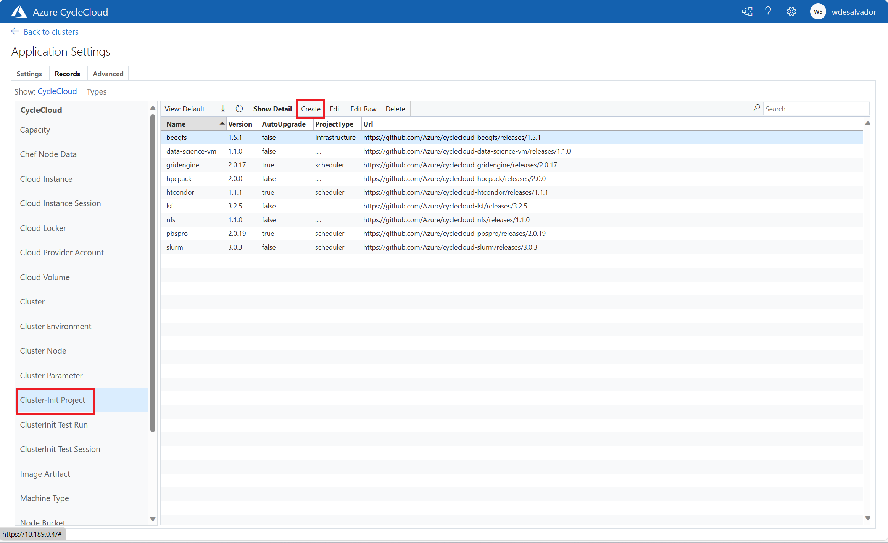
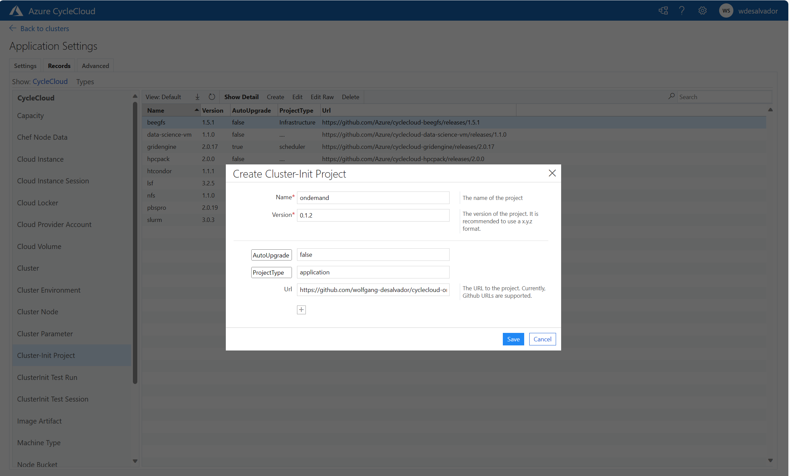

# Azure CycleCloud OnDemand

## Introduction
[Azure CycleCloud](https://learn.microsoft.com/en-us/azure/cyclecloud/overview?view=cyclecloud-8) is an Azure service that allows to orchestrate HPC cluster in Azure Cloud leveraging on standard HPC schedulers like Slurm, OpenPBS and many more.

Once a cluster is created through Azure CycleCloud, it will expose as a default a scheduler and eventually some login nodes where the users have the possibility to login in SSH or using standard scheduler APIs (e.g. SlurmAPI).

This project is aimed to provide an easy way to deploy a web portal improving user experience for job submission, SSH sessions and remote visualization.

The web portal in scope is the OpenSource project [Open OnDemand](https://openondemand.org/)

## The project
Azure CycleCloud provides the flexibility of defining in a modular way customized [projects](https://learn.microsoft.com/en-us/azure/cyclecloud/how-to/projects?view=cyclecloud-8). 

Azure CycleCloud projects are composed by three key elements:
- [**Cluster templates**](https://learn.microsoft.com/en-us/azure/cyclecloud/how-to/cluster-templates?view=cyclecloud-8), containing the relevant parameters that the users can specify in the UI during configuration.
- [**Cluster-init scripts**](), containing a set of tasks that are executed on the node preparation
- [**Blobs**](https://learn.microsoft.com/en-us/azure/cyclecloud/how-to/storage-blobs?view=cyclecloud-8), binaries which are usually installers on the compute nodes

Using this integration framework of Azure CycleCloud, this project contains a whole integration to deploy Open OnDemand portal automatically in Azure CycleCloud.

## Prerequisites
The project requires a working installazion of [Azure CycleCloud](https://learn.microsoft.com/en-us/azure/cyclecloud/overview?view=cyclecloud-8).

At the same time, Open OnDemand portal is meant to be attached to an existing Slurm or OpenPBS cluster in this context. Further support is planned to be available in future releases.

The project has been tested on the following matrix:

<table>
<tr>
<td><b>Azure CycleCloud Version</b></td>
<td><b>Scheduler</b></td>
<td><b>Scheduler Version</b></td>
<td><b>Azure CycleCloud Project Version</b></td>
</tr>
<tr>
<td>8.4.1-3154</td>
<td>Slurm</td>
<td>22.05.9 / 23.02.04</td>
<td>3.0.4</td>
</tr>
<tr>
<td>8.4.1-3154</td>
<td>OpenPBS</td>
<td>18.1.4 / 20.0.1 / 22.05.11</td>
<td>2.0.19</td>
</tr>
</table>

## Importing the project in Azure CycleCloud instance

In order to import the project in the current Azure CycleCloud instance, two steps will be required:
- Importing the cluster template
- Adding the reference to the cluster-init specs in Azure CycleCloud configuration

### Importing the cluster template

The prerequisite to import the project in an existing Azure CycleCloud instance is to have an [Azure CycleCloud CLI](https://learn.microsoft.com/en-us/azure/cyclecloud/how-to/install-cyclecloud-cli?view=cyclecloud-8). This can be also the Azure CycleCloud VM itself with an SSH access.

```bash

git clone https://github.com/wolfgang-desalvador/cyclecloud-ondemand.git
cd ondemand-git
git checkout 0.1.2
cyclecloud import_template -f template/ondemand.txt

```

### Importing the project cluster-init specs in Azure CycleCloud definitions

There are two options to achieve this:
* Through Azure CycleCloud Web UI
* Importing the configuration through a text file placed in Azure CycleCloud installation directories

#### Through Azure CycleCloud Web UI

In order to import the cluster-init specs through the UI, it is sufficient to go to Settings > Records > CycleCloud > Cluster-Init Projects and to create a new project definition as displayed in the following pictures.

The URL for the project is `https://github.com/wolfgang-desalvador/cyclecloud-ondemand/releases/0.1.2`











#### Through the commandline

It is possible to do the same operation from commandline on the Azure CycleCloud VM.

First of asll let's elevate the permission as root on the VM

```bash
sudo su
```

Then, let's insert the following content into a file named `/opt/cycle_server/config/data/ondemand.txt`:

```bash
AdType = "Cloud.Project"
Version = "0.1.2"
ProjectType = "Application"
Url = "https://github.com/wolfgang-desalvador/cyclecloud-ondemand/releases/0.1.2"
AutoUpgrade = false
Name = "ondemand"
```

If import has been successful, after a few seconds the template name should change with the “imported” extension attached:

 ```bash
ls /opt/cycle_server/config/data/

marketplace_site_id.txt.imported  ondemand.txt.imported  settings.txt.imported  theme.txt.imported
```